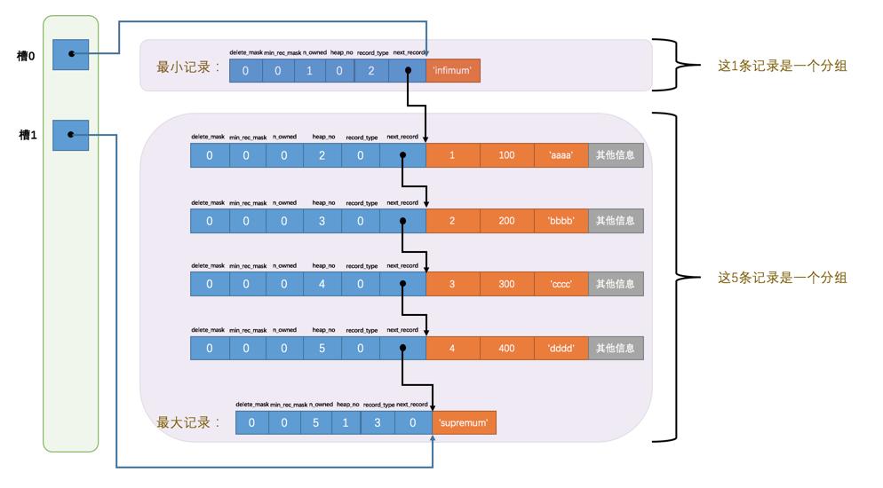

## 数据记录的结构

MySQL将数据划分为若干页，使用页为单位来存储与读取数据，通常页大小为16KB。（页内各条记录是紧邻的吗？应该不一定按照添加顺序排列吧？）
存储记录的格式分为：
- Compact
- Redundant (MySQL5.0之前用的一种老格式)
- Dynamic
- Compressed

指定行格式：
```sql
create table <table> (
    ...
) row_format=<row-format>
```

```sql
alter table <table> row_format=<row-format>
```


各变长字段数据(有可能字符个数是可变的，也有可能是因为字符集为变长字符集)占用的字节数按照列的顺序逆序存放；假设W为字符集中单个字符的最大字节数，M为变长类型可存储的最大字符数，L为字段数据真实占据的字节数，那么当W * M <= 255时，使用单个字节来表示字段所占用的字节数，当W * M > 255时，如果L <= 127，那么用一个字节表示数据占用的字节数，否则用两个字节来表示。在W * M > 255的情况下，表示长度的字节的第一位为标志位，如果它是0，那么该字节表示完整的字段长度，如果是1则表示其为表示长度的两个字节中的一个。

对于每一条记录中可能为null的字段，如果字段的值为null，那么在NULL值列表中用一位1来记录，否则记为0，并且按照字段在表中的顺序逆序排列。MySQL规定NULL值列表必须用整数个字节表示，如果使用的二进制位不构成整数个字节，则在字节的高位补0。

记录头的结构 (不需要记住)：


| 名称 | 大小（单位：bit） | 描述 |
| --- | --- | --- |
| 预留位1 | 1	| 没有使用 |
| 预留位2	| 1	| 没有使用 |
| `delete_mask` | 1 | 标记该记录是否被删除 |
| `min_rec_mask` | 1 | B+树的每层非叶子节点中的最小记录都会添加该标记 |
| `n_owned` | 4 | 表示当前记录拥有的记录数 |
| `heap_no` | 13 | 表示当前记录在记录堆的位置信息 |
| `record_type` | 3 | 表示当前记录的类型，0表示普通记录，1表示B+树非叶子节点记录，2表示最小记录，3表示最大记录 |
| `next_record` | 16 | 表示下一条记录的相对位置 |

在记录的真实数据部分，只会记录非null的数据值。

隐藏列：

| 列名 | 是否必须 | 占用空间 | 描述 |
| --- | --- | --- | --- |
| `DB_ROW_ID` | 否 | 6字节 | 行ID，唯一标识一条记录 |
| `DB_TRX_ID` | 是 | 6字节 | 事务ID |
| `DB_ROLL_PTR` | 是 | 7字节 | 回滚指针 |

InnoDB表对主键的生成策略：优先使用用户自定义主键作为主键，如果用户没有定义主键，则选取一个Unique键作为主键，如果表中连Unique键都没有定义的话，则InnoDB会为表默认添加一个名为`DB_ROW_ID`的隐藏列作为主键。

MySQL对一条记录占用的最大存储空间是有限制的，除了BLOB或者TEXT类型的列之外，其他所有的列（不包括隐藏列和记录头信息）占用的字节长度加起来不能超过65535个字节 (即64KB)。这65535个字节包括了变长字段长度列表和NULL值列表所占据的空间(即storage overhead)。

---
MySQL规定一个数据页至少存放两条记录。

如果一个数据页存放不下各条记录(由于单条记录的最大空间为64KB，所以即使一条也可能会大于页的大小)，则会发生行溢出。此时，对于Compact行格式，对于占用存储空间非常大的列，在记录的真实数据处只会存储该列前768个字节，把剩余的数据分散存储在几个其他的页中，然后记录的真实数据处用20个字节存储指向这些页的地址。

Dynamic和Compressed行格式与Compact格式的不同之处在于，在处理行溢出时，它们不会在记录的真实数据处存储字段真实数据的前768个字节，而是把所有的字节都存储到其他页面中，只在记录的真实数据处存储其他页面的地址。而Dynamic和Compressed格式的区别在于Compressed行格式会采用压缩算法对页面进行压缩，以节省空间。

## 索引页的结构

存放记录的页称为索引页或者数据页。

InnoDB数据页空间的划分：


| 名称 | 中文名 | 占用空间大小 | 简单描述 |
| --- | --- | --- | --- |
| File Header | 文件头部 | 38字节 | 页的一些通用信息 |
| Page Header | 页面头部 | 56字节 | 数据页专有的一些信息 |
| Infimum + Supremum | 最小记录和最大记录 | 26字节 | 两个虚拟的行记录 |
| User Records | 用户记录 | 不确定 | 实际存储的行记录内容 |
| Free Space | 空闲空间 | 不确定 | 页中尚未使用的空间 |
| Page Directory | 页面目录 | 不确定 | 页中的某些记录的相对位置 |
| File Trailer | 文件尾部 | 8字节 | 校验页是否完整 |

记录头信息各部分的含义：

- `delete_mask`: 被删除的记录会打上删除标记，即将`delete_mask`置为1，并放入到垃圾链表中，垃圾链表所占据的空间称为可重用空间，可被新纪录覆盖。不立即彻底删除记录是因为删除操作需要对其他记录在磁盘上重新排列，消耗性能。
- `heap_no`: `heap_no`表示当前记录在本页中的位置。最开始的两条记录是系统自动创建的(成为伪记录)，分别代表最小记录和最大记录（比较记录的大小即比较主键的大小），它们存储在`Infimum + Supremum`部分中。
- `record_type`: 表示记录的类型，0表示普通记录，1表示B+树非叶节点记录，2表示最小记录，3表示最大记录 
- `min_rec_mask`: B+树的每层非叶子节点中的最小记录都会添加该标记(即将其置为1)
- `n_owned`: ?
- `next_record`: 表示从当前记录的真实数据到下一条记录(指按照主键大小进行排序的下一条记录)的真实数据的地址偏移量(如下图所示)


由于`next_record`指向下一个主键值对应的记录，所以页内的各条记录按照主键顺序组成了单向链表，这种结构对于增删而言比较方便，但检索效率不高。为了提高查找速度，将记录分成多组，将每组最后一条记录(该记录的`n_owned`值用于记录该组有几条记录，该组中其他记录的`n_owned`值为0)中真实数据相对于所在页起始字节的地址偏移量存到页目录(在靠近页尾部的位置)，这样的每个地址偏移量称为一个槽，如下图所示：



具体分组规律如下：

- 最初一个数据页里只有最小记录和最大记录，分属两个组
- 之后每插入一条记录，都会从页目录中找到主键值比本记录的主键值大并且差值最小的槽，并把该槽对应记录的`n_owned`值加1，直到该组中的记录数等于8
- 在一个组中的记录数等于8后再插一条记录时，会将组中的记录拆成两个组，一个组中4条记录，另一个5条记录

根据该规则，最大记录所在分组的记录数在 1~8 之间，剩下分组记录数在 4~8 之间。
使用这种结构之后，查找某个主键值对应的记录只需先使用二分法找到它所在的槽（因为槽是根据记录的主键值来排序的，所以可使用二分法），然后使用`next_record`在槽对应的组内进行遍历即可，最多仅遍历8条记录，总的复杂度为O(log n)。

---
Page Header结构：

名称 | 占用空间大小 | 描述
--- | --- | ---
`PAGE_N_DIR_SLOTS` | 2字节 | 在页目录中的槽数量
`PAGE_HEAP_TOP` | 2字节 | 还未使用的空间最小地址，也就是说从该地址之后就是Free Space
`PAGE_N_HEAP` | 2字节 | 本页中的记录的数量（包括最小和最大记录以及标记为删除的记录）
`PAGE_FREE` | 2字节 | 第一个已经标记为删除的记录地址（各个已删除的记录通过next_record也会组成一个单链表，这个单链表中的记录可以被重新利用）
`PAGE_GARBAGE` | 2字节 | 已删除记录占用的字节数
`PAGE_LAST_INSERT` | 2字节 | 最后插入记录的位置
`PAGE_DIRECTION` | 2字节 | 记录插入的方向
`PAGE_N_DIRECTION` | 2字节 | 一个方向连续插入的记录数量
`PAGE_N_RECS` | 2字节 | 该页中记录的数量（不包括最小和最大记录以及被标记为删除的记录）
`PAGE_MAX_TRX_ID` | 8字节 | 修改当前页的最大事务ID，该值仅在二级索引中定义
`PAGE_LEVEL` | 2字节 | 当前页在B+树中所处的层级
`PAGE_INDEX_ID` | 8字节 | 索引ID，表示当前页属于哪个索引
`PAGE_BTR_SEG_LEAF` | 10字节 | B+树叶子段的头部信息，仅在B+树的Root页定义
`PAGE_BTR_SEG_TOP` | 10字节 | B+树非叶子段的头部信息，仅在B+树的Root页定义

属性含义：

- `PAGE_DIRECTION`: 表示页中最后一条记录的插入方向（若新插入的记录的主键值大于上一条记录，则称其插入方向为右，反之则是左）
- `PAGE_N_DIRECTION`: 表示同方向连续新插入记录的条数

File Header结构：

名称 | 占用空间大小 | 描述
--- | --- | ---
`FIL_PAGE_SPACE_OR_CHKSUM` | 4字节 | 页的校验和（checksum值）
`FIL_PAGE_OFFSET` | 4字节 | 页号
`FIL_PAGE_PREV` | 4字节 | 上一个页的页号
`FIL_PAGE_NEXT` | 4字节 | 下一个页的页号
`FIL_PAGE_LSN` | 8字节 | 页面被最后修改时对应的日志序列位置（英文名是：Log Sequence Number）
`FIL_PAGE_TYPE` | 2字节 | 该页的类型
`FIL_PAGE_FILE_FLUSH_LSN` | 8字节 | 仅在系统表空间的一个页中定义，代表文件至少被刷新到了对应的LSN值
`FIL_PAGE_ARCH_LOG_NO_OR_SPACE_ID` | 4字节 | 页属于哪个表空间

属性含义：

- `FIL_PAGE_SPACE_OR_CHKSUM`: 页的校验和
- `FIL_PAGE_OFFSET`: 表示页的页号（究竟是页号还是地址偏移量？）
- `FIL_PAGE_TYPE`: 页的类型。页的类型列表如下：

类型名称 | 十六进制 | 描述
--- | --- | ---
`FIL_PAGE_TYPE_ALLOCATED` | 0x0000 | 最新分配，还没使用
`FIL_PAGE_UNDO_LOG` | 0x0002 | Undo日志页
`FIL_PAGE_INODE` | 0x0003 | 段信息节点
`FIL_PAGE_IBUF_FREE_LIST` | 0x0004 | Insert Buffer空闲列表
`FIL_PAGE_IBUF_BITMAP` | 0x0005 | Insert Buffer位图
`FIL_PAGE_TYPE_SYS` | 0x0006 | 系统页
`FIL_PAGE_TYPE_TRX_SYS` | 0x0007 | 事务系统数据
`FIL_PAGE_TYPE_FSP_HDR` | 0x0008 | 表空间头部信息
`FIL_PAGE_TYPE_XDES` | 0x0009 | 扩展描述页
`FIL_PAGE_TYPE_BLOB` | 0x000A | BLOB页
`FIL_PAGE_INDEX` | 0x45BF | 索引页，也就是我们所说的数据页

- `FIL_PAGE_PREV`, `FIL_PAGE_NEXT`: 表示当前页的上一页和下一页的`FIL_PAGE_OFFSET`的值 (“下一页”的第一条记录和“上一页”的最后一条记录是紧邻的)，因而数据页构成一个双向链表。

File Trailer用于检测页是否完整。它包含8个字节，前4个字节代表校验和，在将记录写入磁盘之前就会先计算出校验和，然后校验和会先写入File Header，最后再写入File Trailer，如果两个校验和不一致，意味着页不完整，此时File Header的校验和表示修改后的校验和，而File Trailer的校验和表示修改前的校验和。后4个字节表示页面被最后修改时日志序列的位置（LSN）。

# B+树索引（临时记录，需要重新看一遍第六章以记录）

innodb页目录中每组包含8条记录，而不是直接包含一条记录可能是考虑到新增槽时需要将新槽后面的槽进行移动，以维持有序数组结构，每组8条记录可以减少需要移动的槽的数目。如果让每组包含更多记录，虽然可以降低插入数据时的性能消耗，但查找效率也会降低。

---
一种不可行的索引方案：使用一个数组目录来记录页号和页中最小的主键值，数组中的目录项按主键值大小进行排序，在根据主键查找某一页时使用二分法根据进行查找。这样的问题是数组所需的连续内存空间太大了，并且在进行增删时需要移动相应目录项后面的所有项。

---
目录项记录和普通用户记录的差别：
- 目录项记录的`record_type`为1，用户记录则为0
- 目录项记录只有主键值和页号两个列，而用户记录有很多自定义列，还有InnoDB添加的隐藏列
- 拥有该页最小主键值的目录项记录的记录头的`min_rec_mask`为1，其他记录中该属性都为0

存储目录项记录的页和存储普通用户记录的页结构是一样的。

---
整个索引的结构：
- 用户记录按照主键顺序构成一个单向链表
- 页目录是数组结构，每个槽（数组的每个元素）对应长度不大于8的一组用户记录，槽内记录按主键排序，槽与槽之间也按槽对应的主键排序。在页目录内使用二分查找来快速查找主键（克服用户记录链表低效查找的缺点）
- 数据页之间按照主键值的顺序构成一个双向链表
- 有专门存储目录项记录的页，每个目录项记录保存其对应的页号和对应页中的最小主键，这些存储目录的页也按照主键顺序构成一个双向链表（克服数据页链表根据主键低效查找页号的缺点，只是此时用于改进查找的目录不再是数组的形式，而是页链表+数组+目录项记录链表的形式）
- 有存储更高层目录项记录的页，以此类推，形成一个多路查找树的结构（B+树）

---
聚簇索引是满足以下条件的一种B+树索引：
1. 使用记录主键值的大小进行记录和页的排序
2. B+树的叶子节点存储完整的用户记录

InnoDB引擎自动创建聚簇索引。

---
以非主键列建立的索引称为二级索引或者辅助索引。在InnoDB中使用二级索引进行查找时需要回表。二级索引的内节点存储索引列的值、主键值以及页号。
以多列的字典序作为排序规则的索引称为联合索引。

---
每当为某个表创建一个B+树索引，都会创建一个根节点页面，之后向表中存入数据时，先把记录存到根节点。当根节点可用空间用完时，先把记录复制到新分配的页，然后将该新页进行页分裂，得到另一个新页，而根节点升级为存储目录项记录的页。

根节点创建之后其地址便不发生改变。
